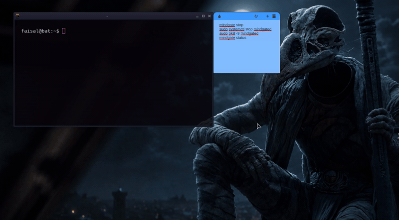
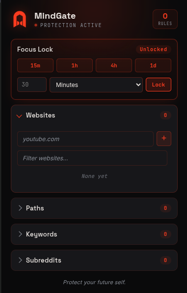
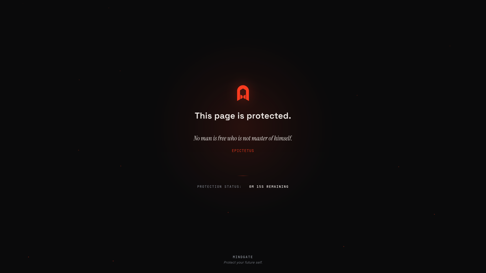
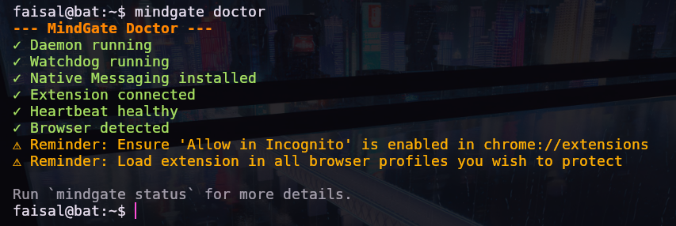

<div align="center">


# MindGate

**A stubborn browser protector for Linux.**

Most focus-blockers ask you to behave. MindGate doesn't ask — it enforces, through a daemon that refuses to shut down while a lock is active, and refuses to let your browser stay open if you try to route around it.

*Protect your future self.*

<br>

[](LICENSE)
[](#supported-platforms)
[](#architecture-in-one-paragraph)
[](#supported-platforms)
[](#license)

<br>



<sub>Lock it in the popup → try to get past it → the CLI itself confirms the lock is real, not just a UI claim.</sub>

</div>

---

### Contents

[Why this exists](#why-mindgate-exists) · [Install](#install) · [Features](#features) · [How a lock holds](#how-a-focus-lock-actually-holds) · [Screenshots](#screenshots) · [CLI](#cli-reference) · [FAQ](#faq) · [Platforms](#supported-platforms) · [Architecture](#architecture-in-one-paragraph) · [Contributing](#contributing)

---

## Why MindGate exists

Every distraction-blocker has the same design flaw: it's a browser extension, and browser extensions can be disabled in three clicks by the exact same person they're supposed to be protecting. The moment your willpower runs out — which is the only moment that matters — you disable it, and it let you.

MindGate is built on the assumption that you, mid-lapse, are not a trustworthy source of instructions. So it splits itself in two, on purpose, so that no single piece of it can be talked out of doing its job:

- **The browser extension** owns every blocking decision — websites, keywords, paths, subreddits. It's the only thing that knows what's on your list.
- **The local daemon** (`mindgated`) doesn't know or care what's blocked. Its only job is watching the extension's pulse. If the extension goes quiet mid-lock — closed, disabled, browser killed — the daemon closes your browser processes instead of quietly letting protection lapse. And while a lock is active, the daemon itself refuses to stop.

Neither half can undo a lock alone. That's not a bug you'd file — it's the entire product.

## Install

```bash
curl -fsSL https://raw.githubusercontent.com/FrenzyDev-git/MindGate/main/installer/Bootstrap.sh | bash
```

One command. Clones the repo, builds the daemon from source, wires up systemd + native messaging. First run takes a few minutes — it's compiling Rust dependencies, not hanging.

Don't run scripts you can't read first — reasonable instinct, so here's the manual path:

```bash
git clone https://github.com/FrenzyDev-git/MindGate.git
cd MindGate
sudo ./installer/install.sh
```

MindGate is open source specifically so a root-owned daemon on your machine doesn't have to be taken on faith. Read `daemon/` before you trust it.

The installer prints one manual step at the end — loading the extension via `chrome://extensions` — since no installer can click that button for you.

## Features

| | |
|---|---|
| 🌐 **Website blocking** | Full domains, subdomains included |
| 🔑 **Keyword blocking** | Matches URLs *and* live page content, not just the address bar |
| 📁 **Path blocking** | Block one path under a domain without blocking the whole site (`reddit.com/r/gaming`, not all of Reddit) |
| 🔒 **Focus Lock** | Timed or forever — the list can't be edited or cleared before it ends |
| 🛡️ **Daemon-guarded** | Extension goes dark mid-lock → daemon closes your browser rather than let protection lapse |
| 🚫 **Stop-resistant** | `mindgate stop` is refused outright while a lock is active |

## How a Focus Lock actually holds

1. Lock in the popup — pick a duration, or forever.
2. The list freezes. No edits, no early unlock, no exceptions.
3. The daemon is told immediately — not on a polling timer — and it now refuses `stop` too.
4. Close the browser, disable the extension, whatever you try — the daemon notices and kills the browser process rather than silently letting the block lapse.
5. Timer hits zero, everything reopens on its own. No new tab, no unlock click, no action from you at all.

## Screenshots

<table>
<tr>
<td width="50%">

<br><sub>The popup. Lock controls and rule categories — nothing you don't need, nothing you have to dig for.</sub>
</td>
<td width="50%">

<br><sub>What replaces the site you were trying to reach.</sub>
</td>
</tr>
<tr>
<td colspan="2">

<br><sub><code>mindgate doctor</code> — every layer checked from the CLI. You don't have to trust the popup's word for it.</sub>
</td>
</tr>
</table>

## CLI reference

```bash
mindgate install        # run the installer
mindgate uninstall      # remove everything, cleanly

mindgate start           mindgate stop
mindgate restart         mindgate status

mindgate doctor          # full health check — daemon, watchdog, heartbeat, native messaging
mindgate logs            # tail daemon logs
```

`mindgate stop` is the one command in that list that has a mind of its own — it does nothing while a lock is active. That's not a missing feature.

## FAQ

**Why does the extension need access to all URLs?**
Because it has to check every page you visit against your block list — a permission scoped to a handful of pre-approved sites would defeat the entire purpose. Full breakdown of every permission and exactly what it's used for: [`PRIVACY.md`](PRIVACY.md).

**Does it work in Incognito?**
Not unless you manually flip "Allow in Incognito" for the extension — Chrome doesn't let an extension grant itself that access. This is a documented, deliberate scope boundary, not an oversight: [`SCOPE.md`](SCOPE.md).

**Can I just uninstall it to get around a lock?**
Yes, while unlocked. MVP1 is built to make impulsive bypass hard, not to make you unable to ever remove your own software from your own machine. Full boundary list — what's defended against and what isn't — lives in [`SCOPE.md`](SCOPE.md).

**Does it phone home?**
No. No server exists to phone home to. No accounts, no analytics, no telemetry — see [`PRIVACY.md`](PRIVACY.md) for the literal source-code-level breakdown.

## Supported platforms

- **OS:** Linux, systemd-based. Verified hands-on on Linux Mint + XFCE. Expected to work on Arch and other systemd distros — the daemon only depends on `systemctl`, nothing distro-specific — but not yet hands-on tested there.
- **Browsers:** Google Chrome, verified directly. Brave, Edge, Vivaldi, Opera — same extension APIs, already watched for by the daemon, but not yet hands-on tested.
- **Not yet supported:** Firefox, non-systemd distros. Full honest scope: [`SCOPE.md`](SCOPE.md).

## Architecture, in one paragraph

The extension (Manifest V3, `declarativeNetRequest` + `webNavigation`) owns every blocking decision and never asks the daemon for permission to block something. The daemon (`mindgated`, Rust) knows almost nothing about *what's* blocked — it only tracks whether the extension is alive, via a heartbeat over native messaging, and whether a lock is active, so it can refuse to stop and can close browsers if the extension vanishes. A companion watchdog and the daemon watch each other, so stopping MindGate means deliberately killing two independent systemd units, not one. Full detail: `ARCHITECTURE.md`.

## Contributing

Issues and PRs welcome. Read [`SCOPE.md`](SCOPE.md) before proposing a feature — it's the single source of truth for what MindGate currently promises, so scope doesn't get relitigated in every thread.

## License

MIT — see [`LICENSE`](LICENSE). Built to be trusted, not just used.

---

<div align="center">
<sub>Not affiliated with Google, Chrome, or any browser vendor. MindGate protects you from yourself — not from a determined attacker with full access to your machine. See <a href="SCOPE.md">SCOPE.md</a> for what's explicitly out of scope.</sub>
</div>